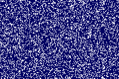
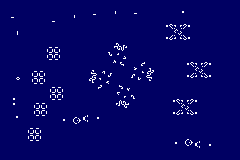

gba-conway
===
This is a toy project of a (heavily) optimized way to simulate Conway's Game of Life on the 
Game Boy Advance.

Conway's Game of Life
---
Wikipedia article: https://en.wikipedia.org/wiki/Conway%27s_Game_of_Life
**Conway's Game of Life** is a very simple simulation, that happens on a 2D grid resided by 
cells. Each cell can either be in an alive or dead state. Each simulation step consists in 
evaluating each cell and its neighbors in order to determine the new state of the cell.
- If the cell is alive, it must have exactly 2 or 3 alive neighbors in order to keep alive.
- If the cell is dead, it must have exactly 3 alive neighbors to become alive.

Each new generation created by this one is completely determined by the previous one, and it was 
also noticed that it can create very definite patterns, such as moving formations of cells 
(called spaceships), stable cell forms that don't chagne (still lifes) and patterns that oscillate
through a fixed number of states (oscillators). Here is an example of each one:

 
 

This drew attention of a lot of people to the interesting cellular automaton (the scientific name
of those simulations). Cellular automata are very 

The challenge
---
Implementing Conway Life on the GBA is a formidable task mainly because of the device's small 
power. It has a 16 MHz ARM7TDMI core and a custom-designed PPU to drive a 240x160 screen. Due to 
the hardware's characteristics, there's only 290896 cycles for each frame in ~60fps. That means, 
if we want to simulate a 240x160 field (with 38400 cells) at 60 fps, we get around 7.315 cycles 
for each cell. 

The problem is, Conway's Game of Life is essentially a convolution algorithm: to determine the
outcome of each cell, you need to know the state of the cell and of its 8 surrounding neighbors.
A naïve algorithm ought to make at least 9 reads to memory and one write to memory. Since, on
the GBA's ARM core, each load takes at least 3 cycles and each store takes at least 2 cycles, 
it means that only loading and storing the required data already takes us 29 cycles! Without
counting the actual algorithm, that means we can't even get 15fps!!

Instead, the idea is to optimize the solution using all the tools necessary. I took three main
approaches for that: abusing the memory layout of GBA graphics, storing multiple cells within a
register to use parallelism, and reducing the number of memory loads by reusing state. Each one
is explained on the following:

1. **Memory layout of GBA graphics:** on its most common background modes (0, 1 and 2), the Game
   Boy Advance is capable of displaying up to 4 tiled backgrounds. Those backgrounds are composed
   of 8x8-pixel tiles (called characters), which are indexed using a "tile map" (also called a 
   screen block). The idea is that, with minimal transfer to its internal VRAM (of which it has 
   only 96 KB), one can create very complex scenes composing the different tiles into a single 
   image.

   Most interesting is the layout in which those tiles are stored into memory. In 4bpp mode,
   each tile row is stored in a single 32-bit value, with each 4 bits representing a pixel.
   Each row is then stored contiguously in VRAM: the first 8-pixel row, then the next row,
   until the last one. _Then_ the second tile comes into memory. Since those tiles will be
   indexed using a tilemap, it is possible to rearrange it in a way that tiles are indexed 
   vertically, _then_ horizontally. This creates an "illusion" that the map is stored in big 
   8-pixel wide columns:

    

   We can here assume that each pixel is a cell (which makes sense, since the simulation has
   heavy aesthetic effect), which gives a perfect opportunity to use...

2. **Parallelism within a single register:** Unfortunately, the ARM7TDMI does not have any SIMD
   instructions, but we can do it with a trick. Each register on the CPU is 32-bits wide, which
   means we can store 8 cells (in 4bpp mode) in a single register. Each cell only have two states,
   alive or dead, and we only need to count at most 8 alive neighbors around the cell, which means
   we can operate on all those 8 cells simultaneously using a single instruction! We do 8
   operations for the price of one!

   Of course, comparing using the conditon (alive? 2 or 3; dead? 3) becomes way more complex, but
   that can be done using bitwise tricks.

3. **Eliminating redundant memory loads:** The state of a cell can determine the state of many
   cells around it, and we can make less round-trips into memory to determine that state. By
   operating on a line-by-line basis, we can cache state that was used to compute an 8-cell
   cluster to operate the next one, and we can cleverly use spare registers to save cycles on
   the most critical loops inside the code.

All that made me able to program a routine that computes the entire 240x160 field of one
generation of Conway's game of line in under a frame. In fact, the first version of the code
runs in under half of a frame's time, freeing a lot of time for an interactive application.

Demonstration
===

- [**First iteration:**](https://github.com/JoaoBaptMG/gba-conway/blob/fb0bdf9c90cdf63efd399e79e464bf1de7af2388/source/conwaySimulationAdvance.s) no micro-optimizations besides the three main branches explained:
  
   
- [**Second iteration:**](source/conwaySimulationAdvance.s) saved one cycle on the condition for aliveness of a cell, shaving 4800 cycles total (but less than 2% of the CPU)
  
  

How to build the project
===

In order to build, you will need DevkitPRO installed on your machine, and the `DEVKITPRO`
environment variable must be pointed to its root. With that, it's just the matter of run `make`
and the files _gba-conway.elf_ and _gba-conway.gba_ will be generated in the project's root
folder.

The controls are as follows:
- **A:** resumes and pauses the simulation
- **B:** pauses the simulation, or frame-advances it
- **Start:** resets the simulation with the provided starting state
- **L+Start:** resets the simulation with a random state

If you want to give a different starting state to the simulation, edit the _starting.png_ file
and use _grit_ (or your favourite tool) to convert it to a source file, replacing _starting.asm_
in _source/assets_. The grit command used to generate it was:

    grit starting.png -tc -gu8 -gB4 -gT000000 -p!

Credits and License
===

The entire repository is licensed under the MIT license, except for the _monogram.png_ file,
which contains characters derived from the font Monogram Extended. It belongs to Vinícius
Menézio and can be found [here](https://datagoblin.itch.io/monogram) under the CC0.
